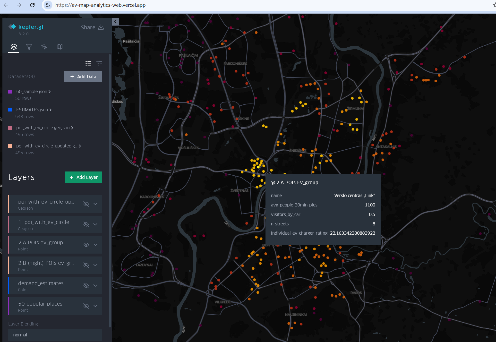
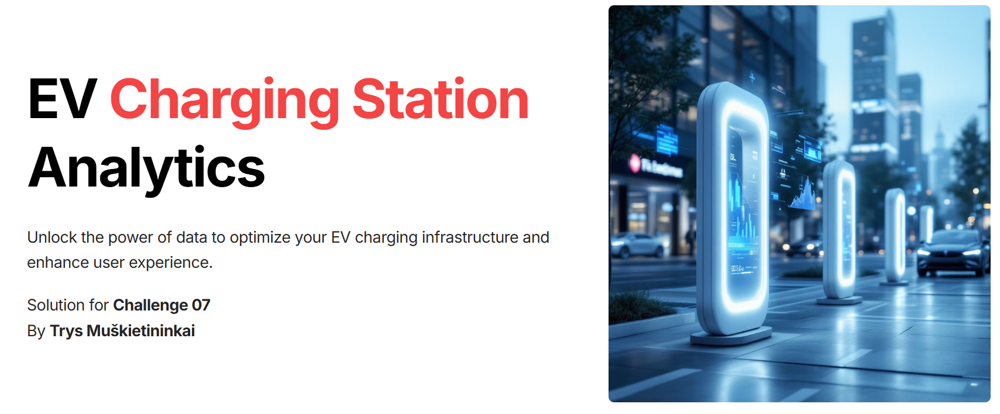

# hack4vilnius

Project for Vilnius Hackathon 2025 (hack4vilnius). Our team worked on the data-driven pilot study for new EV charging stations, proposing potential spots for the construction based on the current EV charging stations usage, traffic information and attendance to specific points of interest within the city of Vilnius. 

## Final result

👉 See result [in action](https://ev-map-analytics-web.vercel.app/)

## Presentation slides

👉 Our [website](https://geo-analytics-p25uks5.gamma.site/)

## Demo video

👉 [Demo](https://www.youtube.com/watch?v=FnlazI4Sm8I)